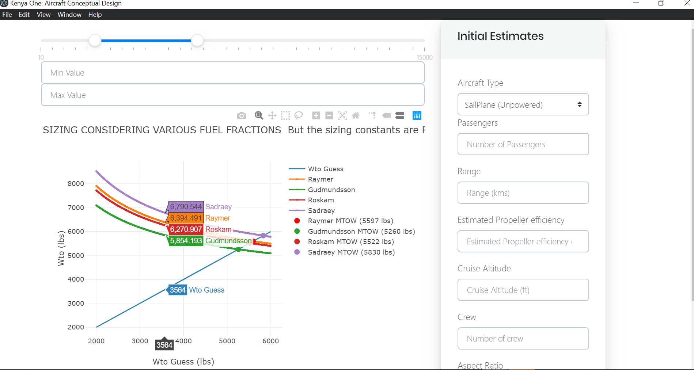

## Welcome to `Kenya One: ✈️ Aircraft Design Software` documentation

<div style="text-align:center">
</div>

> This is an opensource project (implemented in a python/>Django backend and an Electron Frontend for GUI) that was >conceived in the `Aerospace Department at the Technical >University of Kenya`. This project was initially used for >the conceptual and detailed design of the aircraft shown >below.

<div style="text-align:center">
</div>

> Currently it (backend) provides functionalities such as:
>
> - Weight Sizing (empty weight, MTOW, Fuel etc),
> - Wing Surface Area sizing
> - Detailed Component Weight Calculations
> - Lifting Line Theory
> - Performace Sizing: Take-off, Climb, Cruise, Landing
> - etc

`Better documentation and Table Of Contents coming soon...`

<!--  -->

However, now it is being modified to be used for other types of General Aviation and Light Drone aircraft design. Hopefully soon there will be modules to work on Large Aircrafts and possibly Airships.

> The main idea 💡 is that we can have a software that aggregrates all sizing, performance, weight estimation, cost analysis, Drag etc into one platform and reduce over-reliance on fragmented excel, matlab/octave, fortran scripts and incorporate modern visualisation and optimisation into the workflow.
>
> #### Inspiration is derived from works of many great engineers and authors including but not limited to:
>
> - Prof. Snorri Gudmundsson
> - Dr. Raymer
> - Prof. Sadraey
> - Nicolai
> - Roskam
> - Ajoy Kumar Kundu etc

`NB: Majority of logic for the backend have already been implemented, the GUI is what is lacking`

### Work in progress

- [❌] Integrating Electron Framework to build GUI for Windows, MacOS and Linux environments
- [❌] Sharing the React Code with Electron and Web frontend.
- [❌] Django backend to store the data.
- [❌] Deploy the backend so that values can be synce across devices.



`I invite anyone with any ideas to collaborate and add features.`

## Installation 📥

1. Download the files from the repo,

```bash
mkdir <some-directory>

cd <some-directory>

git clone https://github.com/geoffreynyaga/Kenya-One-Project.git .
```

2. Its advised to create a virtual environment

```bash
virtualenv venv
```

3. Activate the environent. For Linux/MacOS users use the command below

```bash
source venv/bin/activate
```

`for windows users`

```bash
cd venv/Scripts

activate.bat
```

4. Install the requirements

   a) Install python packages

   ```bash
   pip install -r requirements.txt
   ```

   b) Install npm packages

   ```bash
   cd Frontend-Electron
   npm install
   ```

### Project layout

```bash
.
├── CORE # python logic
│   ├── API
│   ├── database
│   ├── datasets
│   ├── engines
│   ├── jupyter
│   ├── machine_learning
│   └── weissinger
├── Frontend-Electron #GUI
│   ├── node_modules
│   ├── public
│   └── src
├── Kenya_One # Django Settings Module
│   └── settings
├── accounts
│   ├── api
├── docs #documentation
├── htmlcov #test coverage
├── initial_sizing
├── spreadsheets # excel files with implementation of the app
└── venv #python virtual env
```

5. Create a postgres database on called "anga_utm" or equivalently give it a custom name and make sure to change the value in the local.py settings file

a) `run migrations`

```bash
python manage.py migrate
```

b) `create superuser`

```bash
  python manage.py createsuperuser
```

5. Running the app

```bash
cd Frontend-Electron

npm run electron-dev
```

## Testing 🧪🧪

The projects uses pytest and black as the formatting option. The tests also check for consistencies on code format.

To initiate tests follow the steps below:

> `Run the pytest command`

```bash
pytest
```

The testing results will be displayed and there will also be a `htmlcov` folder generated inside the project that will contain the code coverage details.

<pre>
.
├── CORE
│   ├── API
├── Frontend-Electron
├── Kenya_One
├── accounts
├── docs #documentation
├── <b>htmlcov</b> #test coverage
├── initial_sizing
├── spreadsheets
└── venv
</pre>

Open up the folder and open the `index.html` in your browser to see this information.
